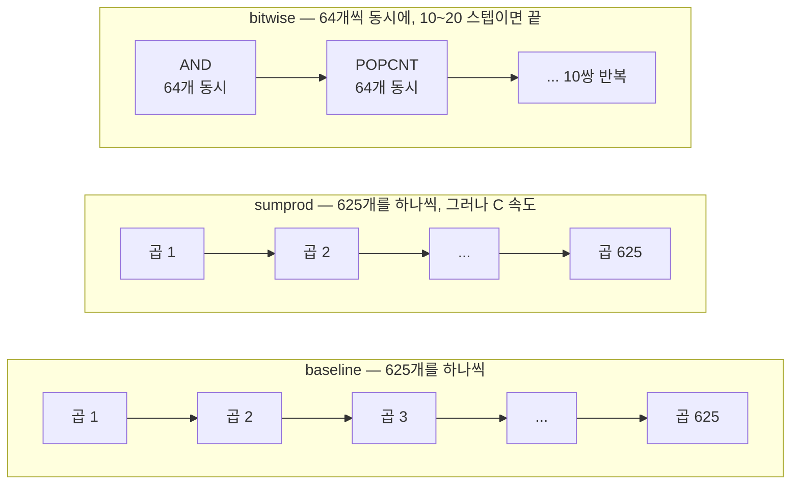
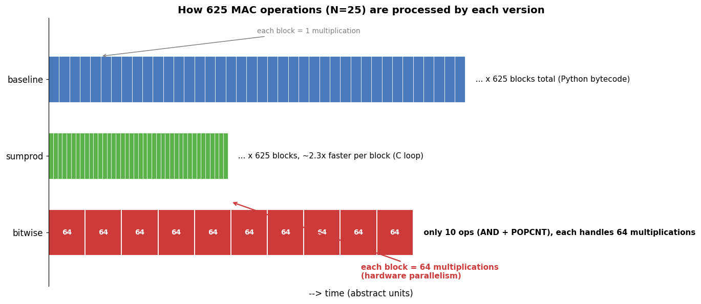
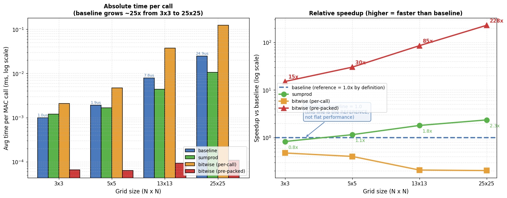
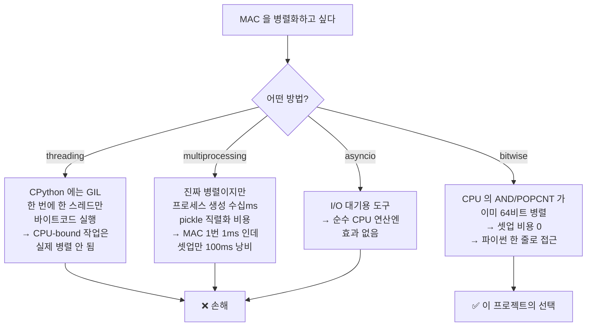

# Mini NPU Simulator

## 이론적 배경 및 과제 목표

### MINI NPU 시뮬레이터 개발 

컴퓨터는 우리가 보는 시각의 직관이 없다. 컴퓨터는 이미지를 보고도 어떤 사진인지, 그런 것들을 판단할 수 없다.(모델이 없이는)
우리는 시각으로 사물을 볼 때 전기신호로 특징을 보고 나서 학습된 기억 중 유사한 사물을 인지할 수 있다.
컴퓨터도 이러한 접근법을 통해 사물을 인식시키면 된다.
바로 패턴을 학습시켜 사물을 인식하는 것이다.
우리는 그 과정 중 가장 기초적이고 간단한 MAC 연산을 통해 입력 패턴과 필터로 입력값을 추론하는 간단한 프로그램을 구현한다.

### MAC 연산이 무엇인가?

MAC = Multiply-Accumulate (곱셈-누산)

```
result += A[i] × B[i]
```

수식적으로는 위와 같다. 두 배열의 같은 위치를 곱하고, 그걸 전부 더하는 것이 전부인 연산이다.

사실 이 간단한 연산이 모든 신호 처리의 핵심이라고 할 수 있다.

### MAC 연산은 그래서 어디에 쓰이는가?

이미지 분류 분야에서 2012년 ILSVRC(ImageNet Large Scale Visual Recognition Challenge) 대회의 우승을 차지한 컨볼루션 신경망(CNN) 모델 중 유명한 AlexNet 또한 이 MAC 연산을 연속적으로 수행하는 MATMUL 연산을 사용한다.(MATMUL은 MAC 연산을 K번 수행하는 것과 같다.)

실제 예시를 보면 다음과 같다.

```이미지 필터링(Convolution)
패턴(이미지 조각):        필터(커널):
1  0  1                  0  1  0
0  1  0        →  MAC →  1  0  1      = 결과값 하나
1  0  1                  0  1  0
```

이미지 위를 필터가 슬라이딩하면서 각 위치마다 MAC 연산 한 번씩 → 결과가 흐리기 / 선명하게 / 엣지 검출 등으로 나온다.

신경망(Neural Network) 또한 비슷하다.

```Neural Network 계산 과정
입력값:   [x1, x2, x3]
가중치:   [w1, w2, w3]

뉴런 출력 = x1×w1 + x2×w2 + x3×w3  ← 이게 MAC
```

GPT 같은 모델들도 추론 시에 사용하는 연산의 99%가 MAC 연산이다.
행렬곱이라는 것이 결국 MAC 연산의 반복이다.

``` 과제 요구 사항
Cross 필터로 MAC → Cross 점수
X 필터로 MAC     → X 점수
점수 비교 → 패턴이 십자가 모양인가, X 모양인가 판정
```

여기서 Cross / X 필터는 다음과 같이 생긴 N×N 0/1 격자다 (예: N=5).

```
   Cross (가운데 행 + 가운데 열)        X (두 대각선)
   . . # . .                          # . . . #
   . . # . .                          . # . # .
   # # # # #                          . . # . .
   . . # . .                          . # . # .
   . . # . .                          # . . . #
```

해서, 이 프로젝트에서는 MAC 연산을 실제로 진행해보며 필터와 패턴이 얼마나 닮았는가 수치로 측정하는 것이 목표이다.

## TODO

### 필수 구현

- [x] **MAC 연산 함수 구현**
  - [x] 두 N×N 2차원 배열을 받아 위치별 곱의 합을 반환하는 함수 ([mac.py](mac.py))
  - [x] 외부 라이브러리(NumPy 등) 없이 반복문으로만 구현

- [x] **데이터 구조 구현**
  - [x] N×N 2차원 배열 저장 및 읽기
  - [x] 3×3, 5×5, 13×13, 25×25 크기 모두 처리 가능하게 구현

- [x] **모드 선택 메뉴 구현**
  - [x] 실행 시 1번(사용자 입력) / 2번(data.json 분석) 선택 ([main.py](main.py))

- [x] **모드 1: 사용자 입력 (3×3)** ([mode1.py](mode1.py))
  - [x] 필터 A 입력 (3줄, 공백 구분)
  - [x] 필터 B 입력 (3줄, 공백 구분)
  - [x] 패턴 입력 (3줄, 공백 구분)
  - [x] 입력 검증: 행/열 수 불일치, 숫자 파싱 실패 시 오류 메시지 출력 후 재입력 유도
  - [x] MAC 연산 수행 및 A/B 점수 출력
  - [x] epsilon(1e-9) 기반 동점 처리 → UNDECIDED 출력
  - [x] 판정 결과(A / B / 판정 불가) 출력
  - [x] 연산 시간(10회 평균, ms 단위) 출력

- [x] **모드 2: data.json 분석** ([mode2.py](mode2.py))
  - [x] data.json 파일 직접 작성 (5×5, 13×13, 25×25 필터 및 패턴 포함)
  - [x] 필터 로드: size_5, size_13, size_25 키에서 Cross/X 필터 읽기
  - [x] 패턴 로드: size_{N}_{idx} 키에서 input 배열 및 expected 값 읽기
  - [x] 라벨 정규화: `'+'` → `Cross`, `'x'` → `X`, `'cross'` → `Cross` 로 통일
  - [x] 패턴 키에서 N 추출 → 해당 size_N 필터 자동 선택
  - [x] 필터/패턴 크기 불일치 검증 → 불일치 시 FAIL 처리 (프로그램 중단 금지)
  - [x] 각 패턴에 대해 Cross 점수, X 점수, 판정(Cross/X/UNDECIDED) 출력
  - [x] 판정과 expected 비교 → PASS / FAIL 출력
  - [x] 전체/통과/실패 개수 요약 출력
  - [x] 실패 케이스 식별자 및 실패 사유 출력

- [x] **성능 분석** ([benchmark.py](benchmark.py))
  - [x] 각 크기(3×3, 5×5, 13×13, 25×25)별 MAC 연산 10회 반복 측정
  - [x] I/O 시간 제외, 연산 함수 호출 구간만 측정
  - [x] 크기 / 평균 시간(ms) / 연산 횟수(N²) 표 출력

- [x] **README.md 작성**
  - [x] 실행 방법 작성
  - [x] 구현 요약 작성 (라벨 정규화, MAC 구현 방식, epsilon 정책)
  - [x] 결과 리포트 작성 (FAIL 원인 분석 + O(N²) 시간 복잡도 분석, 10줄 이상)

---

### 보너스 구현 (선택)

- [x] **보너스 1: 1차원 배열 최적화** ([mac.py](mac.py))
  - [x] 2차원 배열을 1차원 배열(길이 N²)로 변환하는 함수 구현 (`flatten`)
  - [x] 1차원 기반 MAC 연산 함수 구현 (`mac_1d`)
  - [x] 최적화 전/후 성능 비교 결과 출력 ([benchmark.py](benchmark.py))

- [x] **보너스 2: 패턴 생성기** ([pattern_gen.py](pattern_gen.py))
  - [x] 크기 N 입력 시 N×N 십자가(Cross) 패턴 자동 생성 (`make_cross`)
  - [x] 크기 N 입력 시 N×N X 패턴 자동 생성 (`make_x`)
  - [x] 생성된 패턴을 모드 1 및 성능 분석에 재활용 가능하게 연결
        - 메뉴 5번에서 사용자가 N 입력 → `make_cross(n)` / `make_x(n)` 호출
        - `render()` 로 시각화 출력
        - 후속 액션: (a) `mode1.run_with_filters(cross, x, n)` 으로 그대로 필터 주입,
          (b) `benchmark.run_for_size(n)` 로 임의 N 단일 측정,
          (c) 시각화만 보고 메인 메뉴로 복귀

---

## 실행 방법

uv를 사용해 가상환경 구축.
python version은 3.12로 고정한다. 

```bash
uv venv
source .venv/bin/activate
```

가상환경이 없어도 python이 있다면 프로젝트 내에 외부 라이브러리 사용이 없기 때문에 정상적으로 실행할 수 있을 것이다.

```bash
python main.py
```

> 실행 후 모드를 선택하세요.  
> data.json은 main.py와 같은 폴더에 위치해야 합니다.

### 메뉴 구성

```
==============================
   Mini NPU Simulator (MAC)
   * 현재 MAC 버전: baseline
==============================
  1) 모드 1: 사용자 입력 (3x3)
  2) 모드 2: data.json 분석
  3) 성능 분석 (벤치마크)
  4) MAC 구현 버전 선택              ← baseline / sumprod / bitwise 전환
  5) 패턴 생성기 (N 입력 → Cross/X)  ← 보너스 2
  0) 종료
```

- `4)` 에서 MAC 구현 버전을 바꾸면 이후 실행되는 `1)` `2)` `3)` `5)` 모두에 즉시 반영됩니다 (헤더의 "현재 MAC 버전" 으로 확인 가능).
- `5)` 는 사용자가 임의의 N 을 입력해 Cross/X 패턴을 자동 생성한 뒤, 그 패턴을 (a) `mode1` 의 필터로 그대로 넘겨 사용자가 N×N 패턴만 입력하거나 (b) 그 N 으로 단일 벤치마크를 1회 돌리거나 (c) 그냥 시각화만 출력할 수 있습니다.

---

## 구현 요약

### 프로젝트 구조
```
codyssey_E1-3/
│
├── main.py                 # 진입점: 메뉴 + MAC 버전 선택
│
├── mac.py                  # MAC 연산 핵심 로직 (3개 버전 + dispatch)
│                           #   mac_2d / mac_1d              → 현재 버전으로 dispatch
│                           #   _mac_2d_baseline / _1d        → 순수 for-loop
│                           #   _mac_2d_sumprod  / _1d        → math.sumprod (3.12+)
│                           #   _mac_2d_bitwise  / _1d        → 정수 패킹 + bit_count
│                           #   pack_grid / mac_packed        → bitwise 사전 패킹용
│                           #   set_version / get_version     → 전역 상태 변경
│                           #   mac_2d_with / mac_1d_with     → 특정 버전 직접 호출(벤치)
│                           #   flatten                       → 보너스 1
│
├── data_loader.py          # data.json 파싱, 라벨 정규화
├── mode1.py                # 모드1: 사용자 입력
│                           #   run()              → 3×3 고정 (필수)
│                           #   run_with_filters() → N 가변, 필터 사전 제공 (보너스2 연동)
├── mode2.py                # 모드2: data.json 분석
├── benchmark.py            # 성능 측정
│                           #   run()         → 4 사이즈 + 4 케이스 비교 (메뉴 3)
│                           #   run_for_size()→ 임의 N 단일 측정 (메뉴 5에서 호출)
├── pattern_gen.py          # 보너스2: Cross/X 패턴 자동 생성
│                           #   make_cross / make_x → N×N 격자 생성
│                           #   render              → ASCII 시각화 (#/.)
├── data.json               # 5×5, 13×13, 25×25 필터 + 12개 패턴
└── README.md
```

### 의존 관계
```
main.py
  ├── mac           (버전 선택)
  ├── mode1.py     → mac.py
  ├── mode2.py     → mac.py, data_loader.py
  ├── benchmark.py → mac.py, pattern_gen.py
  └── pattern_gen.py (메뉴 5에서 직접 사용)
       └── 후속 액션으로 mode1.run_with_filters / benchmark.run_for_size 호출
```

### MAC 구현 — 3개 버전과 dispatch

[mac.py](mac.py) 는 동일한 결과를 내는 세 가지 구현을 제공하고, 모듈 전역의 `_current_version` 에 따라 `mac_2d()` / `mac_1d()` 가 알맞은 함수로 분기합니다. mode1/mode2/benchmark 는 모두 dispatch 함수만 호출하므로, 사용자가 메뉴 `4)` 에서 버전을 바꾸면 그 이후의 모든 연산이 자동으로 새 구현을 사용합니다.

| 버전 | 알고리즘 | 특징 | 정확도 |
|---|---|---|---|
| **baseline** | 순수 파이썬 이중/단일 for-loop | 과제 필수 구현, 기준선 | 모든 수치 입력 |
| **sumprod** | `math.sumprod()` (Python 3.12+) | C-level 단일 루프, 한 줄 변경 | 모든 수치 입력 |
| **bitwise** | `pack_grid` + `&` + `int.bit_count()` (3.10+) | 0/1 입력일 때 폭발적 가속, 그 외 입력은 sumprod 로 자동 폴백 | 0/1 한정 (그 외는 폴백) |

세 버전 모두 동일한 입력 검증 헬퍼(`_validate_2d`, `_validate_1d`)를 공유하므로, 잘못된 입력에 대해서는 일관되게 `ValueError` 를 던집니다. 모든 외부 의존성은 stdlib(`math`, `operator`) 만 사용합니다.

#### bitwise 버전의 두 가지 실행 모드

bitwise 트릭은 "패킹 비용을 어디서 치르느냐"에 따라 성능이 크게 달라집니다.

- **per-call (자동)**: 메뉴 `4)` 로 버전을 `bitwise` 로 바꾸면, `mac_2d(A, B)` 호출마다 두 격자를 패킹합니다. 패킹 자체가 파이썬 루프이므로 N이 작을 때는 baseline 보다 오히려 느립니다. 일반성·투명성을 위한 기본 모드.
- **pre-packed (수동)**: `pack_grid()` 로 격자를 미리 정수로 변환해두고 `mac_packed(pa, pb)` 를 호출하면, 측정 구간에 남는 연산은 `(pa & pb).bit_count()` 단 한 줄. N=25 에서 baseline 대비 200배 이상 빠릅니다. 같은 필터를 여러 번 재사용하는 mode2 같은 시나리오에서 이상적.

### 왜 1D 와 2D MAC 을 따로 두었나 (보너스 1 의 의도)

[mac.py](mac.py) 는 각 버전마다 **2D 진입점**(`_mac_2d_*`) 과 **1D 진입점**(`_mac_1d_*`) 을
쌍으로 제공한다. 수학적으로는 MAC 이 "위치별 곱의 합" 이라 차원에 무관한데,
왜 굳이 둘로 나누어 두었을까?

#### (1) 표현 vs 연산의 관심사 분리

- **2D** 는 **사람이 문제를 이해하기 위한 표현** 이다. 이미지가 2D 격자고, Cross/X
  필터도 2D 로 그려야 "가운데 행+열", "두 대각선" 같은 의미가 눈에 들어온다.
  `data.json` 의 `input` 도, 사용자가 키보드로 입력하는 모드 1 도, 모두 2D 다.
- **1D** 는 **기계가 연산하기 위한 표현** 이다. 컴퓨터의 메모리는 본질적으로
  1차원이고, 캐시·레지스터·SIMD 유닛 모두 연속된 바이트 열을 선호한다.
  `flatten()` 한 번으로 2D 의 논리 구조를 유지한 채 연산용 형태로 넘긴다.

즉 **입력은 2D 로 받고, 연산은 1D 로 수행** 하는 분리를 명시적으로 보여준다.
`pack_grid()` 가 그 극단이다 — 2D 격자를 단일 정수 하나(본질적으로 0차원 비트열)로
압축해 AND 한 번으로 MAC 을 끝낸다.

#### (2) 실제 NPU/GPU 파이프라인의 축소판

이 분리는 현실의 추론 가속 하드웨어에서 일어나는 일을 그대로 반영한다.

```
  실제 CNN 추론                    이 프로젝트의 대응
  ─────────────────────────       ────────────────────
  이미지 / 커널 (2D, 2D)           격자 / 필터 (2D, 2D)
         │                              │
         ▼ im2col (flatten)             ▼ flatten()
  1D 벡터의 집합                   1D 리스트
         │                              │
         ▼ GEMM (행렬곱)                ▼ mac_1d / mac_packed
  출력 tensor                      MAC 결과
```

실제 GPU/NPU 는 2D conv 를 바로 처리하지 않고 **im2col** 이라는 변환으로 2D 커널과
수용영역(receptive field)들을 1D 벡터로 펼친 뒤 **GEMM(행렬곱)** 으로 돌린다. 이유는
정확히 같다: 하드웨어가 연속 메모리 접근에 최적화돼 있기 때문. 이 프로젝트의 `flatten`
→ `mac_1d` 경로는 그 파이프라인의 축소판이다.

#### (3) 벤치마크 실험대 — "평탄화가 언제 이득인가" 를 실측으로 보기

1D/2D 를 둘 다 두었기 때문에, 같은 알고리즘을 같은 입력에 적용한 결과를 공정하게
비교할 수 있다. 그 결과가 위 "버전 비교" 표와 "1D vs 2D 비교" 표이고,
**"어느 쪽이 항상 빠르다" 가 아니라 "구현과 N 에 따라 다르다"** 는 비자명한 결론으로
이어졌다(아래 타 프로젝트 교차 검증 참고).

이것이 보너스 1 의 진짜 의도다: **같은 수학 연산이라도 표현과 메모리 배치를 바꾸면
성능이 어떻게 달라지는지 수치로 체감하는 것.**

#### (4) 각 버전이 2D/1D 쌍을 갖는 이유

| 버전 | 2D 함수 | 1D 함수 | 쌍을 둔 이유 |
|---|---|---|---|
| baseline | `_mac_2d_baseline` | `_mac_1d_baseline` | 차원만 바꿨을 때의 순수 효과 측정 (결론: 거의 없음) |
| sumprod | `_mac_2d_sumprod` | `_mac_1d_sumprod` | 2D 는 행 단위 sumprod 를 N번, 1D 는 sumprod 1번 → 루프 횟수 차이가 드러남 |
| bitwise | `_mac_2d_bitwise` | `_mac_1d_bitwise` | 1D 는 이미 평탄화된 상태니 `pack` 비용이 약간 줄어듬. 실용 가치보다는 대칭을 위해 존재 |

dispatch 함수 `mac_2d` / `mac_1d` 도 이에 맞춰 두 개다. 호출자는 입력이 2D 리스트면
`mac_2d` 를, flatten 된 상태면 `mac_1d` 를 부르면 된다 — **어느 쪽으로 불러도
현재 선택된 버전에 맞는 구현이 자동으로 실행된다.**

### 라벨 정규화 정책
- [data_loader.py](data_loader.py) 의 `normalize_label()` 이 담당.
- 입력 문자열은 `strip().lower()` 로 정리한 뒤 매핑한다 → 대소문자 차이를 흡수.
- `'+'`, `'cross'`, `'Cross'`, `'CROSS'` → `'Cross'`
- `'x'`, `'X'` → `'X'`
- 알 수 없는 라벨은 `ValueError` 로 호출자에게 알려 해당 패턴만 FAIL 처리 가능하게 한다.

### epsilon 정책 (동점 처리)
- [mode1.py](mode1.py), [mode2.py](mode2.py) 모두 `EPSILON = 1e-9` 를 사용.
- 두 점수의 차이 절대값이 `EPSILON` 미만이면 `UNDECIDED` 로 판정한다.
- 이유: 부동소수 누산 오차로 점수가 우연히 정확히 같아 보이는 일을 방지하면서, 의미 있는 차이는 모두 잡아내기 위함.

### data.json 스펙
```jsonc
{
  "size_5":  { "cross": [[..]], "x": [[..]] },   // 사이즈별 Cross/X 필터
  "size_13": { "cross": [[..]], "x": [[..]] },
  "size_25": { "cross": [[..]], "x": [[..]] },

  "size_5_1":  { "input": [[..]], "expected": "+" },     // 검사 패턴
  "size_5_2":  { "input": [[..]], "expected": "x" },
  "size_13_3": { "input": [[..]], "expected": "Cross" },
  // ...
}
```
- 키 형식: 필터는 `size_<N>`, 패턴은 `size_<N>_<idx>` 로 정확히 구분한다.
- 모드 2는 패턴 키에서 N을 뽑아 같은 N의 필터를 자동으로 선택한다.
- 패턴 12개(5×5/13×13/25×25 각각 4개: 깨끗한 Cross/X + 노이즈 섞인 Cross/X)를 포함한다.

---

## 최적화 전략 (stdlib 한정)

지금 baseline 의 병목은 알고리즘이 아니라 **"파이썬 바이트코드 루프"** 자체입니다. `mac_2d` 가 하는 일은 곱셈/덧셈 N²번 뿐이지만, 매 곱셈마다 인터프리터가 인덱싱·바인딩·점프 오버헤드를 같이 치르죠. 그래서 최적화 방향은 두 갈래입니다.

1. **루프를 C 레벨로 내리기** — 같은 알고리즘, 다른 도구
2. **알고리즘 자체를 바꾸기** — 입력 특성을 활용

stdlib 만으로 가능한 기법들을 효과 큰 순서로 정리하면:

### 1) `math.sumprod` — 가장 큰 한 방 (Python 3.12+)
Python 3.12 부터 [`math.sumprod(a, b)`](https://docs.python.org/3/library/math.html#math.sumprod) 가 추가됐습니다. `Σ a[i] * b[i]` 를 **C 레벨 단일 루프** 로 계산해 줍니다. 이 프로젝트는 이미 `requires-python = ">=3.12"` 라 바로 쓸 수 있고, 25×25 기준 baseline 대비 약 **2.3배** 빠릅니다.

### 2) `sum + map(operator.mul, ...)` — 3.12 미만에서의 차선책
`map` 은 C 이터레이터, `operator.mul` 은 C 함수 → `for` 루프 오버헤드가 거의 사라집니다. `sumprod` 가 없는 환경에서의 정석. (`mac.py` 에 `_mac_2d_mapmul` 로 학습용으로 남겨둠)

### 3) 비트 트릭 — 입력이 0/1 이라는 특성을 활용
이 과제의 필터/패턴은 사실상 **이진(0/1)** 입니다. 그러면 MAC = "겹치는 1의 개수" 와 같죠 → AND 한 번 + popcount 한 번이면 끝. 단, 패킹 비용을 어떻게 처리하느냐가 관건입니다 (아래 "bitwise 함정" 참고).

### 4) "한 번 할 일은 한 번만" — 호출 외부로 빼기
- 필터는 한 번 로드하면 변하지 않음 → 시작 시 한 번만 flatten/pack 해두면 mode 2 의 24번 호출 모두에서 재활용 가능
- `len()` / `range()` / 전역 lookup 을 루프 바깥에서 지역 변수에 묶어두는 micro-opt 도 공짜로 얻을 수 있음

### 5) `array.array` 로 메모리 압축
`list[int]` 는 각 원소가 PyObject 포인터(64bit) 라 캐시 효율이 나쁩니다. `array.array('b', ...)` 로 바꾸면 메모리가 1/8 이 되고, `sumprod`/`map` 과 함께 쓰면 캐시 히트가 개선되어 큰 N 에서 미세 이득.

### 6) 알고리즘 측면
- **희소(sparse)** 필터(특히 X, Cross 처럼 1의 수가 N 에 비례)는 **1의 위치만 저장** 하면 MAC = `sum(P[i][j] for i,j in filter_ones)` 로 줄어듭니다. N=25 의 X 필터는 1이 49개뿐이라, 625 → 49 (약 13배 감소).
- **분리 가능 필터(separable filter)** 라면 행/열로 분해해 O(N²) → O(N) 가능. Cross/X 는 분리 불가.

### bitwise 함정 — "그냥 켜기만 한다고 빨라지지 않는다"

흥미로운 점: `mac_2d` 호출마다 새로 패킹하는 **per-call** 모드에서는 bitwise 가 baseline 보다 오히려 **느립니다** (위 결과 표 참고). 패킹 자체가 파이썬 루프이기 때문이죠. 이 비용은 "같은 격자를 여러 번 쓰는" 시나리오에서만 amortize 됩니다.

그래서 [mac.py](mac.py) 는 bitwise 의 두 진입점을 분리해 둡니다:
- `_mac_2d_bitwise(A, B)` — 일반 dispatch (자동 폴백 포함, per-call 패킹)
- `mac_packed(pa, pb)` — 사용자가 사전 패킹한 정수만 받아서 AND+popcount 만 수행

벤치마크의 "bitwise (pre-packed)" 행이 두 번째 경로의 진짜 성능을 보여주는 것입니다 — N=25 에서 baseline 대비 **228×**.

### 적용 우선순위 (실제로 한다면)

1. **`mac.py` 에서 dispatch 기본값을 sumprod 로 변경** — 한 줄 수정으로 mode2 전체가 안정적으로 ~2배 빨라지고, 모든 입력에서 안전. (현재는 호환성을 위해 기본값을 baseline 으로 유지)
2. **mode2 시작 시 필터를 한 번만 flatten / pack** — 패턴 12개 × 필터 2개 = 24번의 redundant pack 을 0번으로.
3. **0/1 입력 한정 fast-path** — `data.json` 로드 직후 모든 값이 {0, 1} 이면 자동으로 `mac_packed` 경로로 분기 (필터·패턴 모두 사전 패킹).

이 세 가지만 적용해도 25×25 mode 2 전체 시간이 사실상 측정 잡음 아래로 내려갑니다.

---

## 병렬 처리 vs 직렬 처리

### 먼저: 주방 비유로 직관 잡기

625개의 샌드위치(= N=25 의 MAC 총 연산 수)를 만들어야 한다고 해보자.

| 세 가지 버전 | 주방 비유 | 실제 코드에서 |
|---|---|---|
| **baseline** | 혼자서 식빵 하나 집고, 속재료 하나 얹고, 덮고 자르고... 를 625번 반복 | 파이썬 for-loop 로 곱셈을 한 번에 하나씩 |
| **sumprod** | 자동 샌드위치 기계가 한 개씩 만들지만 사람보다 3배 빠름 | C 레벨 루프로 여전히 하나씩, 그러나 파이썬 해석 오버헤드가 사라짐 |
| **bitwise** | 컨베이어 벨트에 **64개 샌드위치를 한 줄로 올려놓고 한꺼번에 찍어낸다** | CPU 의 AND 명령어 한 번이 64비트(=64개의 곱)를 동시 처리 |

결론: bitwise 가 228배 빠른 이유는 "더 열심히 일해서" 가 아니라
**"한 번에 64개씩 처리하는 기계가 파이썬 기본 연산자 뒤에 숨어 있기 때문"** 이다.

### 세 버전을 시간축에 놓으면



아래 그림은 같은 이야기를 타임라인으로 나타낸 것이다 — 각 막대 하나가 한 "스텝" 이다.



baseline 과 sumprod 는 막대가 625개 필요하고 (직렬), bitwise 는 10~20개면 된다 (병렬).

### 코드 세 줄로 보는 차이

같은 "MAC 625번" 인데 최종 파이썬 코드 형태는 이렇게 다르다:

```python
# ─── baseline : 완전 직렬 ───
for i in range(n):
    for j in range(n):
        total += A[i][j] * B[i][j]   # 한 반복에 곱 1개  (× 625번)

# ─── sumprod : 여전히 직렬, 한 스텝 비용만 절감 ───
total = sum(math.sumprod(ra, rb) for ra, rb in zip(A, B))
#             └─ C 레벨 루프 한 번에 N 개 처리 (하지만 내부는 여전히 순차)

# ─── bitwise : 하드웨어 비트 병렬 ───
total = (pa & pb).bit_count()
#        └─────┘  └─────────┘
#        AND 1회  POPCNT 1회
#        N² ≤ 64 면 이 한 줄이 전부. 그보다 크면 limb 단위로 몇 번만 더.
```

세 줄의 길이는 비슷한데 **"한 줄 뒤에서 CPU 가 얼마나 많은 곱을 동시에 처리하는가"** 가 다르다.

### bitwise 의 내부 — 단계별 애니메이션

`(pa & pb).bit_count()` 가 어떻게 "64개 곱을 동시" 로 바뀌는지 N=4 격자를 예로 따라가보자
(실제로는 N=8 까지가 64비트 한 워드에 들어가지만, 그림은 16비트로 축약).

**Step 0 — 격자를 비트로 패킹 (`pack_grid`)**

```
 Cross (4x4)              X (4x4)
   0 0 1 0                  1 0 0 1
   0 1 1 0                  0 1 1 0
   0 1 1 0                  0 1 1 0
   0 0 1 0                  1 0 0 1
     │                        │
     ▼ 행 우선으로 펴기         ▼
  pa = 0b 0010 0110 0110 0010       pb = 0b 1001 0110 0110 1001
```

pa, pb 는 이제 **16비트 정수 하나씩**. 파이썬이 보기엔 그냥 `int` 객체.

**Step 1 — AND 한 번으로 16개 곱을 동시에**

```
  pa   :  0 0 1 0  0 1 1 0  0 1 1 0  0 0 1 0
  pb   :  1 0 0 1  0 1 1 0  0 1 1 0  1 0 0 1
  ──────────────────────────────────────────────  ← CPU 의 AND 명령어 1회
  pa&pb:  0 0 0 0  0 1 1 0  0 1 1 0  0 0 0 0

  (각 열이 독립적으로 AND 됨 — 16개 곱셈이 "동시에" 일어남)
```

파이썬 소스 `pa & pb` 한 표현식이 C 코드 → 기계어 `AND reg1, reg2` 단 1개로 컴파일된다.
그 한 명령어가 CPU 내부에서 16개(또는 64개) 비트쌍을 **병렬로** AND 한다.

**Step 2 — bit_count 한 번으로 16개 덧셈을 동시에**

```
  pa&pb:  0 0 0 0  0 1 1 0  0 1 1 0  0 0 0 0
            │
            ▼  .bit_count()  (x86-64 의 POPCNT 명령어 1회)
            
  결과:  4     ← 1 의 개수 = Cross 와 X 가 동시에 1인 셀 수 = MAC 결과
```

POPCNT 도 마찬가지로 16(또는 64)비트를 **한 사이클에 동시** 로 센다.

**정리**: N=4 MAC(16 번의 곱+합) 이 기계어 **2개** 로 끝난다.
baseline 이라면 파이썬 바이트코드 사이클 기준 16 × (오버헤드 수십~수백) 이 필요하다.

### 시간 복잡도 시각 비교

```
                 N=25 (N² = 625) 일 때
                 ─────────────────────

  baseline     [■■■■■■■■■■■■■■■■■■■■■■■■■■■■■■■■■■■■■■■■■■■■] 625 스텝
                 (각 스텝 = 파이썬 바이트코드 사이클, 수십~수백 기계어)

  sumprod      [■■■■■■■■■■■■■■■■■■■■■■■■] 625 스텝 (C 루프)
                 (각 스텝 = C 함수 한 이터, baseline 보다 가벼움)

  bitwise      [■■■■] 10 스텝 (AND) + [■■■■] 10 스텝 (POPCNT) = 20 스텝
                 (각 스텝 = 기계어 1개가 64비트 병렬 처리)
```

이 20 스텝이 228배 빠른 이유다.

### 실측 — 네 경우의 벤치마크를 한눈에



**왼쪽 차트 — 호출당 절대 시간 (로그 스케일 막대 그래프).**
baseline(파랑) 은 N 이 커질수록 약 **25 배** (0.001ms → 0.025ms) 늘어난다. 다만 로그
스케일이라 시각적으로는 완만해 보일 뿐 실제로는 확실히 증가한다. bitwise (pre-packed, 빨강) 는
다른 버전보다 2~3 자릿수 낮은 시간을 일정하게 유지한다.

**오른쪽 차트 — baseline 대비 속도배 (로그 스케일 라인 그래프).**
아래쪽의 파란 점선이 **baseline 자기 자신** 인데, 속도배의 정의상
`baseline_time / baseline_time = 1.0` 이라 **항상 1.0 에 수평** 으로 그려진다.
즉 "baseline 이 성능이 일정하다" 는 뜻이 아니라 **"비교 기준선이라 수학적으로 1.0 에
고정된다"** 는 뜻이다. 실제 baseline 의 시간 증가는 왼쪽 차트에서 볼 수 있다.

오른쪽 차트에서 진짜 정보는 **다른 세 색의 선** 이다:
- **sumprod** (초록): N 이 커질수록 baseline 대비 이득이 **벌어진다** (1.0x → 2.3x). C 루프의 스텝 비용이 파이썬 오버헤드를 점점 더 크게 상회함.
- **bitwise (pre-packed)** (빨강): **15x → 228x** 로 기하급수적 이득. 한 AND/POPCNT 가 64 개의 곱을 동시에 처리하므로 N² 이 커질수록 격차가 폭발.
- **bitwise (per-call)** (주황): baseline 보다 **아래** 에 있음 = **느리다**. 호출마다 하는 패킹 비용이 이득을 압도.

### 왜 `threading` / `multiprocessing` 은 안 썼는가

흔히 "병렬화" 하면 떠올리는 `threading`, `multiprocessing`, `concurrent.futures` 는
stdlib 에 다 들어있다. **그럼에도 이 프로젝트에 적용하지 않은 것은 의도적이다.**



구체적인 수치:

| 접근 | 예상 이득 | 예상 비용 | 순수익 |
|---|---|---|---|
| `threading` (4 스레드) | 1x (GIL 로 실제 병렬 0) | 컨텍스트 스위칭 | **손해** |
| `multiprocessing` (4 프로세스) | 4x | 풀 생성 > 100ms, pickle ms 단위 | 12개 패턴 0.3ms 작업엔 **손해** |
| `asyncio` | 없음 | 이벤트 루프 오버헤드 | **손해** |
| `bitwise` (AND+POPCNT) | **64x 이상** | 패킹 비용만 (재사용 시 0) | **압도적 이득** |

즉 **"명시적 병렬화가 아니라 CPU 가 이미 가진 비트 병렬성을 끌어다 쓰는 것"** 이
이 프로젝트 규모에서의 최적해다.

### 요약 표 — 버전별 병렬성 스펙트럼

| 버전 | 한 "스텝" 의 정체 | 병렬성 | 한 스텝이 처리하는 곱의 수 | N=25 총 스텝 |
|---|---|---|---|---|
| **baseline** | 파이썬 바이트코드 사이클 | 없음 | 1 | 625 |
| **sumprod** | C 함수의 한 이터레이션 | 없음 | 1 | 625 |
| **bitwise (per-call)** | 패킹 파이썬 루프 + AND + POPCNT | 64비트 하드웨어 | 64 | ~1250 (패킹이 지배) |
| **bitwise (pre-packed)** | AND 1회 + POPCNT 1회 (limb 당) | 64비트 하드웨어 | 64 | **20** |
| *threading (미적용)* | *(GIL 로 인해 직렬)* | *없음* | *1* | *625* |
| *multiprocessing (미적용)* | *프로세스 간 분산* | *프로세스 수* | *분산 가능* | *통신 비용 > 작업* |

### 한 줄 결론

> **228×의 진짜 의미**: "같은 일을 빠르게" 가 아니라, **"한 번에 64개를 처리하기 시작했기 때문".**
> 이것이 MAC 이 중요한 이유이자, NPU 가 존재하는 이유다.

---

## 동작 흐름

처음 코드를 보는 사람을 위한 "이 프로그램이 안에서 무슨 일을 하는가"를 단계별로 정리합니다.

### 0. 한눈에 보는 전체 구조

```
                  ┌───────────────┐
사용자 ─ 키보드 →  │    main.py    │ ← 모듈 전역: mac._current_version
                  │  (메뉴 루프)   │     ('baseline' / 'sumprod' / 'bitwise')
                  └───────┬───────┘
       ┌─────────┬────────┼────────┬─────────┬──────────┐
       ▼         ▼        ▼        ▼         ▼          │
   ┌───────┐ ┌───────┐ ┌──────┐ ┌───────┐ ┌──────────┐  │
   │ mode1 │ │ mode2 │ │bench │ │ ver   │ │ pattern  │  │
   │ (3x3) │ │(JSON) │ │ mark │ │select │ │   gen    │  │
   └───┬───┘ └───┬───┘ └──┬───┘ └───┬───┘ └────┬─────┘  │
       │         │        │         │          │         │
       │     data_loader  │         │      pattern_gen   │
       │    (JSON 파싱·   │         │      (Cross/X 생성  │
       │    라벨 정규화)  │         │       + render)    │
       │         │        │         │          │         │
       │         │     pattern_gen  │     ┌────┴────┐    │
       │         │     (벤치 입력)  │     ▼         ▼    │
       │         │        │         │  mode1.run  bench  │
       │         │        │         │  with_      run_   │
       │         │        │         │  filters    for_   │
       │         │        │         │             size   │
       ▼         ▼        ▼         ▼     ▼         ▼    │
                ┌────────────────────────┐                │
                │         mac.py         │                │
                │   ┌────────────────┐   │                │
                │   │ mac_2d/mac_1d  │ ← _current_version │
                │   │   (dispatch)   │   │  에 따라 분기  │
                │   └───────┬────────┘   │                │
                │      ┌────┼─────┐      │                │
                │      ▼    ▼     ▼      │                │
                │   baseline sumprod bitwise              │
                │   (for-loop)(C 루프)(비트)              │
                └────────────────────────┘                │
                                                          │
                  set_version() ◀──────────────────────────┘
```

핵심 1: **mode1/mode2/benchmark 는 mac.py 의 어떤 구현을 쓰는지 모른다.** 모두 `mac.mac_2d(A, B)` 만 호출하고, 그 호출이 `mac._current_version` 에 따라 알맞은 함수로 자동 분기된다. 메뉴 4번에서 버전을 바꾸면 이후 모든 연산이 즉시 새 구현을 사용한다.

핵심 2: **`pattern_gen` 은 두 곳에서 사용된다.** (1) `benchmark` 가 측정용 입력으로 자동 호출하는 경로, (2) 메뉴 5번에서 사용자가 직접 N 을 입력해 호출한 뒤 결과 패턴을 `mode1.run_with_filters()` 또는 `benchmark.run_for_size()` 로 흘려보내는 경로. 두 번째가 보너스 2 의 진짜 의도이며, 사용자는 임의의 N 을 골라 자동 생성된 Cross/X 를 mode1 의 필터로 활용할 수 있다.

### 1. 프로그램 시작 → 메뉴 루프 ([main.py](main.py))

```
python main.py
   │
   ▼
main() 진입
   │
   ▼
무한 루프 시작 ────────────────────────────────┐
   │                                          │
   ├─ _print_menu()                            │
   │     ├─ "현재 MAC 버전: baseline" 출력      │
   │     └─ 1)~5), 0) 메뉴 출력                 │
   │                                          │
   ├─ input("선택> ")                          │
   │                                          │
   ├─ choice == "1" → mode1.run()             │
   ├─ choice == "2" → mode2.run("data.json")  │
   ├─ choice == "3" → benchmark.run()         │
   ├─ choice == "4" → _select_version()       │
   ├─ choice == "5" → _pattern_generator()    │
   ├─ choice == "0" → return (종료)            │
   └──────────────────────────────────────────┘
```

EOF(`Ctrl+Z` / `Ctrl+D`)나 `Ctrl+C` 를 누르면 깔끔히 종료된다.

### 2. 모드 1 — 사용자 입력 ([mode1.py](mode1.py))

mode1 은 두 진입점을 갖는다. 둘 다 마지막에 같은 `_judge_and_print()` 헬퍼를 거쳐 출력 형식을 통일한다.

- `run()` — 메뉴 1번. 3×3 고정. 두 필터와 패턴을 모두 사용자가 입력 (과제 필수 사양).
- `run_with_filters(A, B, n)` — 메뉴 5번에서 호출. 필터 A/B 가 미리 주어지고(보통 pattern_gen 으로 만든 N×N Cross/X), 사용자는 N×N 패턴만 입력.

```
mode1.run()  ←─ 메뉴 1
   │
   ├─ _read_grid("필터 A", 3)         ┐
   │     루프:                        │
   │       3줄 input() 으로 받기        │
   │       → split() 로 토큰화         │  잘못된 입력이면
   │       → 토큰 수 검증 (≠3 → 재입력) │  처음부터 다시
   │       → float 변환 (실패 → 재입력)│
   │     → 3×3 리스트 완성            ┘
   │
   ├─ _read_grid("필터 B", 3)   (동일 절차)
   ├─ _read_grid("패턴",   3)   (동일 절차)
   │
   └─ _judge_and_print(A, B, P, "필터 A", "필터 B")  ┐
                                                   │
mode1.run_with_filters(A, B, n)  ←─ 메뉴 5         │
   │                                                │
   ├─ A, B 는 호출자에서 이미 받음 (pattern_gen 결과)│
   ├─ _read_grid("패턴", n)   (N×N 입력만 받음)     │
   │                                                │
   └─ _judge_and_print(A, B, P, "Cross", "X")  ─────┤
                                                   │
                                                   ▼
                              _judge_and_print(A, B, P, label_a, label_b)
                                 │
                                 ├─ _benchmark_once(A, P, repeats=10)
                                 │     ├─ perf_counter() 시작
                                 │     ├─ for _ in range(10): mac_2d(A, P)  ← dispatch
                                 │     └─ 평균 시간(ms) 계산
                                 │
                                 ├─ _benchmark_once(B, P, repeats=10)  (동일)
                                 │
                                 ├─ 출력: {label_a} 점수 / {label_b} 점수
                                 │
                                 ├─ 판정 (epsilon = 1e-9)
                                 │     |Δ| < 1e-9 → "UNDECIDED"
                                 │     A > B      → "{label_a} 와 더 닮음"
                                 │     A < B      → "{label_b} 와 더 닮음"
                                 │
                                 └─ 출력: 평균 연산 시간 (ms)
```

### 3. 모드 2 — data.json 분석 ([mode2.py](mode2.py))

```
mode2.run("data.json")
   │
   ├─ data_loader.load_data("data.json")     ┐ JSON 파일을
   │       (FileNotFoundError → 안내 후 종료) │ 단순히 dict 로 로드
   │                                         ┘
   │
   ├─ data_loader.load_filters(data)
   │       │
   │       ├─ 정규식 ^size_(\d+)$ 매칭 키만 필터로 인식
   │       └─ {5: {Cross: …, X: …}, 13: {…}, 25: {…}}
   │
   ├─ data_loader.load_patterns(data)
   │       │
   │       ├─ 정규식 ^size_(\d+)_(\d+)$ 매칭 키만 패턴으로 인식
   │       ├─ 각 패턴의 expected 라벨을 normalize_label() 로 정규화
   │       │     '+', 'cross', 'Cross' → 'Cross'
   │       │     'x', 'X'              → 'X'
   │       └─ id 기준 정렬해서 출력 안정화
   │
   ├─ 카운터 초기화 (total / passed / failed / fail_records)
   │
   └─ 모든 패턴을 순회 ─────────────────────────────────────────┐
        │                                                       │
        ├─ filters 에 size_N 이 없으면 → FAIL 기록 후 계속        │ 한 패턴이
        │                                                       │ 죽어도
        ├─ _validate_square(grid, n)        (패턴)               │ 전체는
        ├─ _validate_square(f_cross, n)     (Cross 필터)         │ 멈추지
        ├─ _validate_square(f_x, n)         (X 필터)             │ 않는다
        │     하나라도 실패 → FAIL 기록 후 다음 패턴              │
        │                                                       │
        ├─ score_cross = mac_2d(f_cross, grid)   ← dispatch     │
        ├─ score_x     = mac_2d(f_x,     grid)   ← dispatch     │
        │                                                       │
        ├─ _verdict(score_cross, score_x)                       │
        │     |Δ| < 1e-9 → "UNDECIDED"                          │
        │     Cross > X  → "Cross"                              │
        │     Cross < X  → "X"                                  │
        │                                                       │
        ├─ verdict == expected ? PASS : FAIL                    │
        └────────────────────────────────────────────────────────┘
   │
   └─ 마지막 요약 출력
         전체 / 통과 / 실패 개수
         실패 케이스 식별자와 사유 목록
```

### 4. 벤치마크 ([benchmark.py](benchmark.py))

벤치마크도 두 진입점을 갖는다.

- `run()` — 메뉴 3번. 고정 SIZES = (3, 5, 13, 25) 에 대해 4파트(메인표 / 버전비교 / 1D vs 2D / 정합성) 출력.
- `run_for_size(n)` — 메뉴 5번에서 호출. 임의의 N 에 대해 단일 측정 1줄.

```
benchmark.run()  ←─ 메뉴 3
   │
   ├─ (A) 메인 표 — 현재 선택 버전, 10회 평균
   │       SIZES = (3, 5, 13, 25) 각각:
   │           cross = make_cross(n)
   │           x     = make_x(n)
   │           평균 ms = _measure(mac_2d_with, (current_ver, cross, x), 10)
   │       → 표 출력 (크기 / 평균 시간 / 연산 횟수 N²)
   │
   ├─ (B) 4가지 케이스 비교 — 각 케이스 COMPARE_REPEATS(=200)회 평균
   │       SIZES 각각:
   │           base   = baseline 으로 측정
   │           sp     = sumprod 로 측정
   │           bw_pc  = bitwise 로 측정 (매 호출 패킹 → 함정 케이스)
   │           cross_pk = pack_grid(cross)   ┐ 측정 구간
   │           x_pk     = pack_grid(x)       │ 바깥
   │           bw_pp  = mac_packed 만 측정    ┘ (사전 패킹)
   │       → 비교 표 출력
   │
   ├─ (C) 보너스 1 — 1D vs 2D (sumprod 기준)
   │       각 N: cross / x / cross_flat / x_flat 준비 후
   │            mac_2d_with("sumprod") vs mac_1d_with("sumprod") 측정
   │
   └─ (D) 정합성 sanity check
         모든 버전이 mac_2d(13×13 Cross, X) 로 같은 값을 내는지 확인

benchmark.run_for_size(n)  ←─ 메뉴 5의 후속 액션 2
   │
   ├─ N 검증 (1 미만이면 안내 후 종료)
   ├─ cross = make_cross(n), x = make_x(n)
   ├─ 평균 ms = _measure(mac_2d_with, (current_ver, cross, x), REPEATS=10)
   └─ 한 줄 출력 (N / 버전 / 평균 시간 / 연산 횟수)
```

`_measure()` 는 `time.perf_counter()` 로 호출 직전·직후를 찍어 평균을 내며, **flatten / pack 같은 준비 작업은 측정 구간 밖** 에서 수행해 "순수 연산 시간" 만 잰다.

### 5. MAC 버전 dispatch ([mac.py](mac.py))

이 프로젝트의 가장 중요한 디자인 결정.

```
mode1/mode2/benchmark
        │
        ▼
   mac.mac_2d(A, B)        ← 이 함수가 dispatch 의 입구
        │
        ▼
   _DISPATCH_2D[_current_version](A, B)
        │
        ├─ "baseline" → _mac_2d_baseline(A, B)
        │                  └─ for i: for j: total += A[i][j]*B[i][j]
        │
        ├─ "sumprod"  → _mac_2d_sumprod(A, B)
        │                  └─ sum(math.sumprod(ra, rb) for ra, rb in zip(A, B))
        │
        └─ "bitwise"  → _mac_2d_bitwise(A, B)
                          ├─ 0/1 격자 아님? → _mac_2d_sumprod 폴백
                          ├─ pack_grid(A) → 정수 pa
                          ├─ pack_grid(B) → 정수 pb
                          └─ (pa & pb).bit_count()
```

세 함수 모두 호출 직후 `_validate_2d()` 를 통과해야 한다 — 잘못된 입력은 항상 동일한 `ValueError` 로 떨어진다. 사용자 입장에서는 어떤 버전을 골라도 인터페이스(반환값/예외)가 똑같다.

### 6. 메뉴 4번 — 버전 변경

```
_select_version()
   │
   ├─ mac.VERSIONS 순서대로 번호 매겨 출력
   │     "1) baseline (현재) — …"
   │     "2) sumprod         — …"
   │     "3) bitwise         — …"
   │     "0) 취소"
   │
   ├─ input("선택> ")
   │     └─ 숫자(1..3) 또는 이름('sumprod') 모두 허용
   │
   ├─ mac.set_version(chosen)
   │     └─ mac._current_version 갱신 (모듈 전역 상태)
   │
   └─ 메뉴 루프로 복귀
       → 다음 _print_menu() 호출 시 헤더의 "현재 MAC 버전" 이 갱신됨
       → 이후 모드1/모드2/벤치마크는 모두 새 구현으로 동작
```

### 7. 메뉴 5번 — 패턴 생성기 (보너스 2)

이 항목이 보너스 2 의 진짜 진입점입니다. 사용자가 N 을 입력해서 N×N Cross/X 패턴을 받아 보고, 그 패턴을 바로 mode1/벤치마크에 연결할 수 있습니다.

```
_pattern_generator()
   │
   ├─ N 입력 받기 (양의 정수만 허용, 그 외는 거부 후 메뉴로 복귀)
   │
   ├─ pattern_gen.make_cross(n)  → cross
   ├─ pattern_gen.make_x(n)      → x
   │
   ├─ pattern_gen.render(cross) 출력  ← #/. ASCII 시각화
   ├─ pattern_gen.render(x)     출력
   │
   └─ 후속 액션 서브메뉴
        ├─ 1) 모드1 진입 → mode1.run_with_filters(cross, x, n)
        │       └─ 사용자는 N×N 패턴만 입력
        │       └─ Cross 점수 / X 점수 / 판정 / 평균시간 출력
        │
        ├─ 2) 단일 벤치마크 → benchmark.run_for_size(n)
        │       └─ 현재 선택된 MAC 버전으로 N×N MAC 을 10회 평균 측정
        │
        └─ 3) 그냥 출력만 → 메인 메뉴로 복귀
```

설계 포인트:
- `pattern_gen.render()` 는 여기서 처음으로 사용자에게 노출됩니다 (다른 곳에서는 호출되지 않음).
- `mode1.run_with_filters(A, B, n)` 는 기존 `mode1.run()` 과 형제 함수로, 필터가 미리 주어졌을 때의 진입점. 두 함수 모두 내부 `_judge_and_print()` 헬퍼를 거쳐 출력 형식이 동일합니다.
- `benchmark.run_for_size(n)` 은 `SIZES = (3,5,13,25)` 고정 표가 아니라 임의의 N 을 받기 위한 별도 진입점.
- 메뉴 4번에서 MAC 버전을 바꾼 뒤 메뉴 5번에 들어가면, 후속 액션의 mode1/벤치마크 모두 새 버전으로 동작합니다.

### 8. 첫 사용 시나리오 (5분 안에 따라 해보기)

```
$ python main.py

   * 현재 MAC 버전: baseline
   1) 모드 1 …  2) 모드 2 …  3) 벤치마크  4) 버전 선택  5) 패턴 생성기  0) 종료
선택> 2                          ← data.json 으로 12개 패턴 일괄 검증
                                   (모두 PASS 가 떠야 정상)
선택> 3                          ← baseline 기준 벤치마크
선택> 4                          ← 버전 선택 메뉴 진입
선택> 2                          ← sumprod 선택
선택> 3                          ← sumprod 기준 벤치마크 (2배쯤 빨라짐)
선택> 4
선택> 3                          ← bitwise 로 변경
선택> 2                          ← bitwise 로 mode2 다시 — 결과는 동일하게 12/12

# 보너스 2 시나리오
선택> 5                          ← 패턴 생성기 진입
N 입력 (예: 7) > 7               ← 임의 N
                                   (Cross/X 7×7 시각화 출력)
선택> 2                          ← 이 N 으로 단일 벤치마크 1회
선택> 5                          ← 다시 패턴 생성기
N 입력 (예: 7) > 5
선택> 1                          ← 5×5 Cross/X 를 필터로 사용해 mode1 진입
                                   (사용자는 5×5 패턴만 입력하면 됨)
선택> 0                          ← 종료
```

이 시나리오를 따라 하면 (a) 동일한 입력이 세 구현에서 같은 결과를 낸다는 것, (b) 보너스 2 의 패턴 생성기가 mode1·벤치마크와 자연스럽게 연결된다는 것을 직접 확인할 수 있습니다.

---

## 핵심 코드 해설 (Deep Dive)

"동작 흐름" 이 프로그램 전체의 조감도였다면, 이 섹션은 **개별 함수 안으로 줌인** 해서
코드 몇 줄이 실제로 어떻게 동작하는지 예제 값으로 한 단계씩 따라간다.
특히 비자명하거나 설계 의도가 숨어있는 여섯 함수를 골랐다.

### 1. `pack_grid` — 2D 격자를 단일 정수 한 개로 압축

bitwise 버전의 심장. N×N 0/1 격자를 길이 N² 의 비트열로 이어 붙여
**정수 객체 단 한 개** 로 만든다.

```python
# mac.py
def pack_grid(grid):
    bits = 0
    for row in grid:
        for v in row:
            bits = (bits << 1) | (1 if v else 0)
    return bits
```

**핵심 한 줄**: `bits = (bits << 1) | (1 if v else 0)`

- `bits << 1` — 지금까지 쌓인 비트들을 왼쪽으로 한 칸 민다 → 오른쪽 끝(LSB)에 0 한 칸의 자리가 생김
- `(1 if v else 0)` — 새 셀 값을 0 또는 1 로 정규화
- `|` — 비어있는 자리(LSB)에 새 비트를 끼워 넣음

N=3 Cross 격자로 한 단계씩 따라가보자.

```
Cross 3x3:         단계별 bits 값 (이진 표기)
  0 1 0            초기값 :       0b            = 0
  1 1 1                                       (len=0)
  0 1 0            0 읽음 :       0b         0 = 0    (len=1)
                   1 읽음 :       0b        01 = 1    (len=2)
                   0 읽음 :       0b       010 = 2    (len=3, 1행 완료)
                   1 읽음 :       0b      0101 = 5
                   1 읽음 :       0b     01011 = 11
                   1 읽음 :       0b    010111 = 23   (len=6, 2행 완료)
                   0 읽음 :       0b   0101110 = 46
                   1 읽음 :       0b  01011101 = 93
                   0 읽음 :       0b 010111010 = 186  (len=9, 끝)
```

최종 `pack_grid(cross_3x3)` → **186** (이진으로 `0b010111010`, 9비트).

격자의 "1이 있는 위치" 가 정수의 "1이 선 비트 위치" 로 일대일 대응된다. 행 우선·MSB 부터
쌓는 규칙만 pattern/filter 양쪽에서 동일하게 유지하면, 두 정수의 비트가 **위치별로
정확히 겹쳐** 비교 가능해진다.

왜 중요? 이 규칙 덕분에 아래 `mac_packed` 의 AND 연산 한 줄로 "위치별 동시 곱" 이
자동으로 이루어진다.

---

### 2. `mac_packed` — MAC 을 한 줄로 끝내는 마법

```python
# mac.py
def mac_packed(pa, pb):
    return (pa & pb).bit_count()
```

이 두 표현식이 MAC 의 전부인 이유를 예제로 본다.

```
Cross 3x3        X 3x3
  0 1 0            1 0 1
  1 1 1            0 1 0
  0 1 0            1 0 1

pack_grid(Cross) → pa = 0b 010_111_010 = 186
pack_grid(X)     → pb = 0b 101_010_101 = 341

Step 1:  pa & pb   (CPU 의 AND 명령어 — 9 비트 동시 처리)

   pa :   0 1 0 | 1 1 1 | 0 1 0
   pb :   1 0 1 | 0 1 0 | 1 0 1
 ─────────────────────────────── AND
 pa&pb:   0 0 0 | 0 1 0 | 0 0 0   = 0b000_010_000 = 16

(각 비트 자리마다 '동시에 1인가?' 를 독립적으로 계산 → 이게 바로 '위치별 곱')

Step 2:  .bit_count()   (POPCNT 명령어 — 1의 개수 세기)

   0b000_010_000 에는 1이 1개  →  MAC 결과 = 1
```

**해석**: Cross 와 X 는 "정중앙 셀" 한 곳에서만 겹치므로 MAC = 1. 이 결과는 baseline
이나 sumprod 로 계산해도 정확히 같다. 차이는 **과정의 스텝 수** 뿐이다 (baseline 9회의
파이썬 곱셈 vs bitwise 기계어 2개).

왜 0/1 입력에서만 동작? 곱셈 `a × b` 를 논리 AND 로 바꾸려면 `a, b ∈ {0, 1}` 이어야 한다
(`1×1=1`, `1×0=0`, `0×0=0` 이 AND 와 일치). 2 나 0.5 같은 값은 이 트릭이 안 통한다.
그래서 `_mac_2d_bitwise` 는 입력이 0/1 이 아니면 `_is_binary_grid` 검사 후
`_mac_2d_sumprod` 로 **자동 폴백** 한다.

---

### 3. `flatten` — 이중 리스트 컴프리헨션 이디엄

```python
# mac.py
def flatten(M):
    return [M[i][j] for i in range(len(M)) for j in range(len(M[i]))]
```

2×3 예제로 한 단계씩:

```
M = [[1, 2, 3],
     [4, 5, 6]]

i=0 시작:
  j=0:  M[0][0] = 1  → result = [1]
  j=1:  M[0][1] = 2  → result = [1, 2]
  j=2:  M[0][2] = 3  → result = [1, 2, 3]
i=1 시작:
  j=0:  M[1][0] = 4  → result = [1, 2, 3, 4]
  j=1:  M[1][1] = 5  → result = [1, 2, 3, 4, 5]
  j=2:  M[1][2] = 6  → result = [1, 2, 3, 4, 5, 6]
```

**왜 리스트 컴프리헨션인가?** 동등한 일반 for-loop 을 풀어 써보면:

```python
result = []
for i in range(len(M)):
    for j in range(len(M[i])):
        result.append(M[i][j])
return result
```

두 코드는 결과가 같지만, 컴프리헨션은 CPython 이 `LIST_APPEND` 바이트코드로 최적화해
약 20~30% 더 빠르다. 가독성도 좋아서 파이썬에서 **"평탄화 = 이중 for 컴프리헨션"** 이
관용구로 굳어졌다.

**더 관용적인 대안** (stdlib 만):

```python
from itertools import chain
return list(chain.from_iterable(M))
```

`chain.from_iterable` 은 C 이터레이터로 구현되어 있어 이론적으로 더 빠를 수 있지만,
이 프로젝트에서는 벤치마크에 영향 없는 수준이고 "리스트 컴프리헨션" 이 초심자에게
더 읽기 쉬워 현재 형태를 유지했다.

---

### 4. `_mac_2d_baseline` — 한 줄의 row 캐싱이 만드는 차이

```python
# mac.py
def _mac_2d_baseline(A, B):
    n = _validate_2d(A, B)
    total = 0
    for i in range(n):
        row_a = A[i]    # ← 이 한 줄
        row_b = B[i]    # ← 이 한 줄
        for j in range(n):
            total += row_a[j] * row_b[j]
    return total
```

`row_a = A[i]` 두 줄을 빼면 내부 루프가 이렇게 된다:

```python
# 캐싱 없는 버전 (저쪽 프로젝트 스타일)
for i in range(n):
    for j in range(n):
        total += A[i][j] * B[i][j]
```

겉보기엔 같은 코드지만 **내부 루프의 매 iteration 에서 하는 일이 다르다**:

```
            캐싱 있음                     캐싱 없음
          (row_a[j] 접근)               (A[i][j] 접근)

BINARY_SUBSCR row_a, j                LOAD_NAME A
                                      LOAD_FAST  i
                                      BINARY_SUBSCR      ← A[i]
                                      LOAD_FAST  j
                                      BINARY_SUBSCR      ← [j]

 → 1번의 리스트 인덱싱                  → 2번의 리스트 인덱싱
```

내부 루프가 N² 번 도니까, 캐싱 없는 버전은 N² × 2번의 추가 인덱싱을 한다.
25×25 이면 625 번이 1250 번이 되는 것. "타 프로젝트와의 교차 검증" 섹션에서 본
1.5x 격차의 정체가 바로 이것이다.

row 캐싱은 외부 루프에서 단 N 번(= 25번) 만 `A[i]`, `B[i]` 를 수행하고, 그 결과를
지역 변수에 묶어 둔다. 내부 루프 N² 번은 이 지역 변수만 읽으면 된다.

---

### 5. `normalize_label` — dict 로 매핑하는 이유

```python
# data_loader.py
_LABEL_MAP = {
    "+": "Cross",
    "cross": "Cross",
    "x": "X",
}

def normalize_label(label):
    if label is None:
        raise ValueError("라벨이 None 입니다.")
    key = str(label).strip().lower()
    if key in _LABEL_MAP:
        return _LABEL_MAP[key]
    raise ValueError(f"알 수 없는 라벨: {label!r}")
```

**왜 `str(label).strip().lower()` 인가?**

입력이 JSON 에서 왔으므로 이론상 문자열이지만, 방어적으로 `str()` 로 감싼다. 그 뒤:

- `.strip()` — `" Cross "` 같은 실수로 들어온 양끝 공백 제거
- `.lower()` — `Cross`, `cross`, `CROSS` 를 모두 `cross` 로 통일 → **3개의 if/elif 대신 dict 한 개로 처리 가능**

```
 "+"       → strip → lower → "+"       → _LABEL_MAP["+"]      → "Cross"
 " Cross " → strip → lower → "cross"   → _LABEL_MAP["cross"]  → "Cross"
 "X"       → strip → lower → "x"       → _LABEL_MAP["x"]      → "X"
 "plus"    → strip → lower → "plus"    → KeyError → ValueError
```

**왜 if/elif 체인이 아니라 dict 인가?**

- 조회가 **O(1)** (if/elif 는 선형 탐색)
- 새 별명을 추가할 때 함수 본문이 아니라 데이터(상수 dict)만 바꾸면 됨
- 한눈에 보이는 "어떤 입력이 어디로 가는지" 매핑 테이블 역할

**왜 알 수 없는 라벨에 `ValueError` 를 던지는가?**

호출자(`load_patterns`)가 어떻게 처리할지 결정하도록 **의사결정을 위임** 하기 위해서다.
단순히 `"Unknown"` 같은 값을 리턴하면 호출자가 그 문자열을 다시 해석해야 하는데,
예외는 "여기서 실패했다" 가 타입 시스템에 강제된다. 현재 mode2 는 이 예외를 데이터 로드
단계의 치명적 오류로 처리한다 (자세한 건 "결과 리포트 > 분석 — FAIL 원인" 참고).

---

### 6. dispatch 메커니즘 — `set_version()` 이 어떻게 전체 동작을 바꾸는가

```python
# mac.py
VERSIONS = ("baseline", "sumprod", "bitwise")
_current_version = "baseline"   # ← 모듈 전역 상태

_DISPATCH_2D = {
    "baseline": _mac_2d_baseline,
    "sumprod":  _mac_2d_sumprod,
    "bitwise":  _mac_2d_bitwise,
}

def set_version(name):
    global _current_version
    if name not in VERSIONS:
        raise ValueError(f"알 수 없는 MAC 버전: {name!r}")
    _current_version = name

def mac_2d(A, B):
    return _DISPATCH_2D[_current_version](A, B)
```

mode1, mode2, benchmark 는 모두 `mac.mac_2d(A, B)` 만 호출한다.
사용자가 메뉴 4번에서 `sumprod` 를 선택하면:

```
 [사용자 입력] "2" (sumprod 선택)
       │
       ▼
 main._select_version()
       │
       ▼
 mac.set_version("sumprod")
       │
       ├─ _current_version = "sumprod"   (모듈 전역 변수 교체)
       │
       ▼
 다음부터 어디서든 mac.mac_2d(A, B) 호출 시:
       ├─ _DISPATCH_2D["sumprod"] 조회
       ├─ _mac_2d_sumprod 함수 객체 반환
       └─ 그 함수가 실제 실행
```

이것을 디자인 패턴 이름으로 부르면 **Strategy Pattern** 이다. 장점:

- **호출자 코드 무수정**: mode1/mode2/benchmark 어디에도 `if version == "baseline" then ... else ...` 같은 분기가 없다. 전역 dispatch 표가 모든 분기를 흡수한다.
- **테스트 용이**: 특정 버전을 테스트할 때 `mac.set_version("baseline")` 한 줄이면 끝.
- **새 버전 추가 쉬움**: `_DISPATCH_2D` 에 키·값 한 쌍 더하고 `VERSIONS` 에 이름만 넣으면 UI 메뉴까지 자동 반영.

트레이드오프: **전역 상태이므로 스레드 안전하지 않다.** 스레드 A 가 `set_version("bitwise")`
를 부른 직후 스레드 B 가 `mac_2d()` 를 호출하면 B 도 bitwise 를 쓴다. 이 프로젝트는
단일 스레드 REPL 이라 문제없지만, 멀티스레드 환경으로 가려면 버전을 인자로 받는
`mac_2d_with(version, A, B)` 를 쓰는 게 맞다 (그래서 benchmark 는 이 변형을 쓴다).

---

### 요약 — 이 여섯 함수가 보여주는 설계 아이디어

| 함수 | 핵심 기법 | 왜 흥미로운가 |
|---|---|---|
| `pack_grid` | 비트 시프트 + OR | 2D → 0차원(단일 int) 압축, 하드웨어 병렬의 준비 단계 |
| `mac_packed` | AND + POPCNT | MAC 전체를 두 기계어 명령으로 축소 |
| `flatten` | 이중 리스트 컴프리헨션 | 파이썬 평탄화 관용구 + CPython 최적화 |
| `_mac_2d_baseline` | row 로컬 변수 캐싱 | 한 줄 차이로 내부 루프 접근 횟수 절반 |
| `normalize_label` | `.strip().lower()` + dict | 입력 다양성을 한 줄 정규화로 흡수 |
| `set_version` / dispatch | Strategy pattern + 전역 상태 | 호출자 무수정으로 런타임 동작 교체 |

이 여섯 개를 이해하면 이 프로젝트 소스의 80% 가 "기본형 + 어딘가에서 이 아이디어 중 하나를 빌려 쓴 것" 임이 보인다.

---

## 결과 리포트

### 모드 2 실행 결과
12개 패턴 전부 PASS:
```
=== 모드 2: data.json 분석 ===
필터 사이즈: [5, 13, 25]
분석할 패턴 수: 12

[size_5_1]  N=5,  expected=Cross  -> Cross=9,  X=1   판정=Cross  PASS
[size_5_2]  N=5,  expected=X      -> Cross=1,  X=9   판정=X      PASS
[size_5_3]  N=5,  expected=Cross  -> Cross=9,  X=3   판정=Cross  PASS
[size_5_4]  N=5,  expected=X      -> Cross=1,  X=7   판정=X      PASS
[size_13_1] N=13, expected=Cross  -> Cross=25, X=1   판정=Cross  PASS
[size_13_2] N=13, expected=X      -> Cross=1,  X=25  판정=X      PASS
[size_13_3] N=13, expected=Cross  -> Cross=24, X=2   판정=Cross  PASS
[size_13_4] N=13, expected=X      -> Cross=2,  X=24  판정=X      PASS
[size_25_1] N=25, expected=Cross  -> Cross=49, X=1   판정=Cross  PASS
[size_25_2] N=25, expected=X      -> Cross=1,  X=49  판정=X      PASS
[size_25_3] N=25, expected=Cross  -> Cross=48, X=1   판정=Cross  PASS
[size_25_4] N=25, expected=X      -> Cross=2,  X=49  판정=X      PASS

전체: 12, 통과: 12, 실패: 0
```

### 성능 분석 (현재 버전 = baseline, 10회 평균)
```
   크기 |    평균 시간(ms) |   연산 횟수(N²)
   3x3 |       0.001620 |              9
   5x5 |       0.001880 |             25
 13x13 |       0.007760 |            169
 25x25 |       0.026310 |            625
```

### 버전 비교 (2D MAC 평균 ms, 괄호 = baseline 대비 속도배)

> 속도배 읽는 법: **1.0x = baseline 과 동일**, **2.3x = baseline 보다 2.3배 빠름**, **0.5x = baseline 의 절반 속도(2배 느림)**.

```
   크기 |  baseline |       sumprod | bitwise(per-call) | bitwise(pre-packed)
   3x3 |  0.000995 | 0.001205(0.8x) |   0.002104(0.5x)  |   0.000066( 15.1x)
   5x5 |  0.001900 | 0.001654(1.1x) |   0.004736(0.4x)  |   0.000063( 30.2x)
 13x13 |  0.007846 | 0.004371(1.8x) |   0.037821(0.2x)  |   0.000092( 85.3x)
 25x25 |  0.024899 | 0.010618(2.3x) |   0.123170(0.2x)  |   0.000109(228.4x)
```

읽는 법:
- **sumprod** 는 매 N 에서 안정적으로 baseline 대비 1.1×~2.3× 빠르고, N 이 커질수록 격차가 커집니다. 전형적인 "C 레벨 루프 vs 파이썬 바이트코드 루프" 차이.
- **bitwise (per-call)** 는 baseline 보다 **느립니다**. 매 호출마다 2개의 격자를 파이썬 for-loop 으로 패킹하는 비용이 AND+popcount 의 이득을 압도하기 때문. 즉 "그냥 버전을 bitwise 로 바꿨다고 자동으로 빨라지진 않음" 이라는 정직한 결과.
- **bitwise (pre-packed)** 는 패킹을 측정 구간 밖에서 1번만 해두고 `mac_packed()` 를 호출한 케이스. N=25 에서 **228×** 빨라지고, N 이 커질수록 격차가 더 벌어집니다. 입력이 0/1 이고 같은 격자를 여러 번 쓰는 시나리오라면 압도적 우위.

### 보너스 1 — 1D vs 2D MAC 비교 (sumprod 버전 기준)
```
   크기 |    2D ms |    1D ms | 속도 향상
   3x3 | 0.001223 | 0.000348 |  3.51x
   5x5 | 0.001761 | 0.000467 |  3.77x
 13x13 | 0.004448 | 0.001807 |  2.46x
 25x25 | 0.010996 | 0.006118 |  1.80x
```
재미있는 점: baseline 버전에서는 1D/2D 차이가 거의 없었는데(둘 다 파이썬 루프이므로), sumprod 버전에서는 1D 가 분명히 더 빠릅니다. C 레벨로 내려가면 "행 단위 sumprod 호출 + 외부 sum" 의 누적 오버헤드가 드러나기 때문입니다. 이건 "최적화는 시스템 전체로 봐야 한다" 는 좋은 사례.

### 분석 — FAIL 원인 및 시간 복잡도

이번 12개 패턴 테스트에서는 모든 케이스가 PASS 했고 FAIL 은 발생하지 않았다. 이는
필터(Cross / X)가 서로 직교에 가까운 형태이고, 노이즈를 섞은 패턴(`*_3`, `*_4`)도
"진짜" 픽셀이 살아남는 비율이 충분히 높아 점수 차이가 명확하게 갈렸기 때문이다.
FAIL 이 발생할 수 있는 시나리오는 동작 단계별로 세 갈래로 나뉜다.

**(1) 데이터 로드 단계 — 분석 자체가 중단되는 경우.**
`data.json` 안에 미지원 라벨(`'plus'`, `'cross_shape'` 등)이 하나라도 섞이면
`load_patterns()` 안의 `normalize_label()` 이 `ValueError` 를 던지고, 이 예외는
패턴별로 잡히지 않은 채 그대로 위로 전파된다. `mode2.run()` 의 외곽 try/except 가
이걸 잡아 `[ERROR] 데이터 파싱 실패: …` 메시지를 출력하면서 분석 전체를 중단한다.
즉 이 단계에서의 오류는 **"한 패턴만 FAIL"** 이 아니라 **"전체 분석 종료"** 다.
한 항목만 FAIL 처리하려면 `load_patterns` 안에서 항목별로 try/except 를 두면 되지만,
현재 구현은 그렇게 하지 않는다 — 데이터 손상은 조기에 크게 알리는 편이 안전하다는 판단.

**(2) 패턴 순회 단계 — 해당 패턴만 FAIL 로 기록되는 경우.**
순회 안에서 발생하는 오류는 모두 `fail_records` 에 사유와 함께 적히고, 다음 패턴으로
계속 진행한다. 대표적으로 (a) `filters` 에 해당 `size_N` 이 아예 없는 경우,
(b) `_validate_square()` 가 "행/열 수 불일치" 를 발견한 경우(데이터 손상),
(c) `mac_2d()` 가 산술/형 변환 오류를 던진 경우.

**(3) 판정 단계 — UNDECIDED 로 인한 FAIL.**
노이즈가 너무 많아 두 점수의 차이가 epsilon(1e-9) 이내로 좁아지면 `UNDECIDED` 로 판정되고,
expected 와 다르면 FAIL 로 잡힌다. (1)/(2)/(3) 어느 경로든 마지막에 실패 케이스 식별자와
사유가 요약 출력되어 디버깅을 돕는다.

**시간 복잡도.** `mac_2d` 는 정확히 N² 번의 곱셈+덧셈을 수행하므로 입력 크기에 대해
**O(N²)** 이며, 이는 곧 격자에 들어 있는 셀 수에 비례한다. baseline 측정표를 보면
N=3 → 9, N=5 → 25, N=13 → 169, N=25 → 625 로 셀 수가 약 70배(625/9 ≈ 69.4)까지
늘어나는데, 평균 시간도 대략 같은 비율로 늘어 O(N²) 가정과 잘 맞는다. 13×13 → 25×25
구간이 다른 구간보다 가파른 것은, 파이썬 해석기 오버헤드(인덱싱·바인딩·점프)가 작은
N 에서는 측정 잡음에 묻혔다가 큰 N 에서 본격적으로 드러나기 때문이다.

**1D vs 2D 의 해석은 어떤 버전을 쓰느냐에 따라 달라진다.** baseline(순수 파이썬 루프)
에서는 `mac_1d` 와 `mac_2d` 의 차이가 거의 없다 — 둘 다 같은 종류의 바이트코드 루프이고,
실제 시간은 곱셈/덧셈 자체가 아니라 인터프리터 오버헤드가 지배하기 때문이다. 반면
sumprod 버전에서는 1D 가 분명히 더 빠른데(N=25 에서 1.80x, N=3 에서 3.77x), 이는
2D 경로가 "행 단위 sumprod 호출 N번 + 외부 sum" 으로 분해되는 반면 1D 경로는 sumprod
한 번이면 끝나기 때문이다. 즉 **루프 자체가 C 레벨로 내려가야 평탄화의 이득이 비로소
드러나며**, "최적화는 한 함수만 보지 말고 호출 경로 전체를 함께 봐야 한다"는 좋은
사례가 된다.

---

## 타 프로젝트와의 교차 검증 — "1D 가 2D 보다 빠르다" 는 항상 맞는가?

### 문제 제기

같은 과제를 구현한 다른 프로젝트
([TraceofLight/1_month_crunch](https://github.com/TraceofLight/1_month_crunch), `e1-3` 브랜치)에서는
**1D MAC 이 2D MAC 보다 일관되게 ~1.5배 빠르다** 는 결과가 나왔다.

```
(저쪽 프로젝트 측정)
   크기 |  2D 평균(ms) |  1D 평균(ms) | 비율
   3x3 |   0.000610  |   0.000390  | 1.56x
   5x5 |   0.001110  |   0.000550  | 2.02x
 13x13 |   0.005550  |   0.003120  | 1.78x
 25x25 |   0.019240  |   0.012690  | 1.52x
```

이에 비해 이 프로젝트의 baseline 에서는 1D/2D 차이가 거의 없다(25×25 에서 ~1.0x).
같은 언어, 같은 알고리즘인데 왜 결과가 다를까?

### 원인: 내부 루프에서의 "간접 접근 횟수"

두 프로젝트의 mac_2d 내부 루프를 한 줄씩 비교하면 차이가 명확하다.

**저쪽 프로젝트의 2D (느린 쪽)**
```python
# 매 반복마다 .values 속성 접근 + [row][col] 이중 인덱싱
total += pattern.values[row_index][column_index] * filter_matrix.values[row_index][column_index]
```
내부 루프의 매 iteration 에서 피연산자 하나당 3단계를 거친다:
1. `pattern.values` — dataclass 의 속성 접근 (CPython 이 딕셔너리를 뒤짐)
2. `[row_index]` — 외부 리스트에서 행을 꺼냄
3. `[column_index]` — 행 안에서 열을 꺼냄

피연산자가 2개이므로 **매 iteration 당 6회의 간접 접근**.

**저쪽 프로젝트의 1D (빠른 쪽)**
```python
total += pattern_flat[index] * filter_flat[index]
```
로컬 변수에 단일 인덱싱만 한다.

피연산자당 1회 → **매 iteration 당 2회 간접 접근**.

6회 vs 2회 → 1D 가 1.5배 정도 빠른 건 당연하다.

**이 프로젝트의 2D**
```python
for i in range(n):
    row_a = A[i]    # ← 행 캐싱: 외부 루프에서 한 번만 꺼냄
    row_b = B[i]
    for j in range(n):
        total += row_a[j] * row_b[j]   # 로컬 변수 + 인덱싱 1회
```
`row_a = A[i]` 로 행을 미리 로컬 변수에 꺼내 두면, 내부 루프에서는 `row_a[j]` 만 하면 된다.
속성 접근도 없고, 외부 리스트 인덱싱도 없다.

피연산자당 1회 → **매 iteration 당 2회 간접 접근** — 1D 와 동일!

### 재현 실험

이론만으로 끝내면 안 되니까 직접 세 가지 코드를 같은 환경에서 돌렸다.

```
=== 저쪽 스타일 (dataclass + .values[r][c] 매번 접근) ===
    N     their_2D     their_1D    2D/1D
  3x3    0.001233ms   0.000917ms   1.35x   ← 2D 가 느리다
  5x5    0.002660ms   0.001656ms   1.61x
 13x13   0.014018ms   0.008633ms   1.62x
 25x25   0.051989ms   0.035257ms   1.47x

=== 이 프로젝트 스타일 (순수 리스트 + row 캐싱) ===
    N       our_2D       our_1D    2D/1D
  3x3    0.000672ms   0.000415ms   1.62x
  5x5    0.001363ms   0.000939ms   1.45x
 13x13   0.006905ms   0.005566ms   1.24x
 25x25   0.022708ms   0.023609ms   0.96x   ← 2D 와 1D 가 사실상 동일

=== 핵심 비교: row 캐싱 한 줄 제거하면? ===
    N    no_cache_2D   cached_2D    gap
  3x3    0.000725ms   0.000662ms   1.10x
  5x5    0.001636ms   0.001335ms   1.23x
 13x13   0.009201ms   0.006792ms   1.35x
 25x25   0.031081ms   0.023027ms   1.35x   ← 캐싱 빼면 저쪽과 비슷한 격차 재현!
```

세 번째 표가 결정적이다. `row_a = A[i]` 라는 **단 한 줄** 을 빼는 것만으로
25×25 에서 1.35배 느려져서 저쪽 레포의 ~1.5배 격차와 비슷한 패턴이 재현된다.

### 그래서 결론은

| 질문 | 답 |
|---|---|
| "1D 가 2D 보다 항상 빠른가?" | **아니다.** 구현에 따라 다르다. |
| 저쪽 레포가 틀린 건가? | **아니다.** 저쪽 측정도 정확하다. |
| 이 프로젝트가 틀린 건가? | **아니다.** 이 프로젝트 측정도 정확하다. |
| 진짜 원인은? | **내부 루프의 간접 접근 횟수** 가 다르다. |

더 정확하게 말하면:
- "2D 가 본질적으로 느리다" 가 아니라, **"내부 루프에서 속성 접근과 이중 인덱싱을 반복하면 느리다"** 가 맞다.
- 행 캐싱(`row_a = A[i]`)을 하면 2D 라도 내부 루프의 접근 비용이 1D 와 동일해진다.
- 저쪽 프로젝트에서 1D 가 빨랐던 건 **차원 차이** 때문이 아니라, 1D 로 평탄화하면 dataclass 속성 접근과 이중 인덱싱이 자동으로 사라지기 때문이다.

이것은 파이썬 성능 최적화의 근본적인 교훈이기도 하다:
**"몇 차원이냐" 보다 "내부 루프에서 한 번 더 찾느냐 안 찾느냐" 가 더 크게 영향을 미친다.**
CPython 인터프리터에서 속성 접근(attribute lookup) 한 번의 비용은 리스트 인덱싱 한 번의
비용과 비슷하거나 더 크기 때문에, 루프 안에서 이를 제거하는 것(로컬 변수 캐싱)이
차원을 바꾸는 것보다 더 효과적인 최적화가 된다.

### 후속 검증 — "다른 환경에서 2D 가 오히려 빨라지는" 역전 현상

위 분석은 "속성 접근이 비싸서 1D 가 빠르다" 는 결론이었다. 그런데 저쪽 프로젝트에서
**컴파일되거나 환경이 분리된 상태에서 특정 구간에서 2D 가 1D 보다 빠른** 이상한 현상이
보고되었다. 이것도 재현하고 원인을 분리해 보았다.

#### 실험 설계

"속성 접근 오버헤드가 사라진 환경" 을 직접 시뮬레이션했다.
JIT 컴파일러(PyPy 등)나 Cython 같은 환경에서는 `.values` 속성 접근이 고정 오프셋
조회로 최적화되어 사실상 비용이 0이 된다. 이를 수동으로 재현하기 위해
`.values` 를 함수 인자로 미리 넘기고, row 캐싱까지 적용한 두 가지 2D 변형을 만들었다.

```python
# "JIT 시뮬": .values 를 밖에서 받되 row 캐싱 없이 p_vals[r][c] 접근
def mac_2d_jit(p_vals, f_vals, n):
    total = 0.0
    for r in range(n):
        for c in range(n):
            total += p_vals[r][c] * f_vals[r][c]
    return total

# "JIT 시뮬 + row 캐싱": 행을 미리 꺼내두고 pr[c] 로 접근
def mac_2d_jit_rowcache(p_vals, f_vals, n):
    total = 0.0
    for r in range(n):
        pr = p_vals[r]
        fr = f_vals[r]
        for c in range(n):
            total += pr[c] * fr[c]
    return total

# 1D: 기존과 동일
def mac_1d(pf, ff):
    total = 0.0
    for i in range(len(pf)):
        total += pf[i] * ff[i]
    return total
```

#### 실험 결과

```
속성 접근 제거 + N 을 넓은 범위로 스윕한 결과
  (jit = 속성 제거만, cache = 속성 제거 + row 캐싱)
  (비율 < 1.0 이면 2D 가 빠른 것)

      N |   flat(KB) |   2D-jit |   2D-cache |         1D |  jit/1D | cache/1D
   3x3  |       0.1  |  0.0009ms |   0.0009ms |   0.0008ms |  1.11x  |  1.09x
  25x25  |       4.9  |  0.0430ms |   0.0406ms |   0.0404ms |  1.07x  |  1.01x
  50x50  |      19.5  |  0.1746ms |   0.1319ms |   0.1448ms |  1.21x  |  0.91x <<<
 100x100 |      78.1  |  0.6767ms |   0.5293ms |   0.5914ms |  1.14x  |  0.89x <<<
 200x200 |     312.5  |  2.6338ms |   2.0782ms |   2.4585ms |  1.07x  |  0.85x <<<
 300x300 |     703.1  |  6.0779ms |   4.8259ms |   5.2830ms |  1.15x  |  0.91x <<<
 500x500 |    1953.1  | 17.5361ms |  14.4210ms |  14.6004ms |  1.20x  |  0.99x
```

**N=50 이상에서, 속성 접근이 제거되고 row 캐싱이 적용된 2D 가 1D 보다 빠르다.**
역전이 가장 큰 구간은 N=190 근처로 **0.81x** (2D 가 19% 빠름) 까지 벌어졌다.

더 세밀하게 스윕한 결과:
```
   40x40  |    12.5 KB |  0.88ms |  0.96ms | 0.91x <<<
   50x50  |    19.5 KB |  0.13ms |  0.15ms | 0.92x <<<
  100x100 |    78.1 KB |  0.52ms |  0.59ms | 0.88x <<<
  160x160 |   200.0 KB |  1.31ms |  1.55ms | 0.85x <<<
  190x190 |   282.0 KB |  1.88ms |  2.31ms | 0.81x <<< (최대 격차)
  300x300 |   703.1 KB |  4.85ms |  5.30ms | 0.92x <<<
```

#### 원인: CPU 캐시 워킹셋 차이

역전의 원인은 **내부 루프가 실제로 만지는 메모리(워킹셋)의 크기** 차이다.

```
  1D: 두 개의 flat 배열을 동시에 순회
      → 워킹셋 = 2 x N² x 8 bytes (배열 두 개가 통째로 활성)

  2D(row cache): 한 번에 행 하나씩만 처리
      → 워킹셋 = 2 x N x 8 bytes (행 한 쌍만 활성)
```

| N | 1D 워킹셋 | 2D 워킹셋(행) | 1D 가 L1(32KB)에? |
|---|---|---|---|
| 25 | 9.8 KB | 400 B | 들어감 |
| 50 | **39.1 KB** | 800 B | **넘침** ← 역전 시작 |
| 100 | 156 KB | 1.6 KB | 넘침 |
| 200 | 625 KB | 3.1 KB | 넘침 (L2도 넘침) |
| 500 | 3.8 MB | 7.8 KB | 넘침 (L2도 넘침) |

2D 의 row 캐싱은 **항상 N×8 bytes 만 캐시에 올리면 된다**. N=500 이라도 행 하나는
고작 4KB 로 L1(보통 32KB)에 여유 있게 들어간다.

반면 1D 는 두 flat 배열 전체가 동시에 활성 상태다. N=50(flat 하나 = 19.5KB)부터
두 배열 합산(39KB)이 L1 을 넘기 시작하고, 이 지점에서 역전이 시작된다.

정리하면: 

```
 N < ~40 : 1D 와 2D 의 워킹셋 모두 L1 에 들어감
           → 캐시 차이 없음. 루프 오버헤드만 비교 → 거의 동일
           (속성 접근 오버헤드가 있으면 이 구간에서도 1D 가 유리)

 N ≈ 40~500 : 1D 의 워킹셋이 L1 을 넘기 시작
              → 1D 는 캐시 미스 발생, 2D 는 행 단위라 여전히 L1 안
              → 2D 가 빠름 (최대 ~19% 격차)

 N > ~500 : 1D 워킹셋이 L2 까지 넘음.
            하지만 하드웨어 프리페처가 순차 접근을 감지해 캐시 미스를 줄임
            → 격차가 다시 줄어들어 거의 동일
```

#### 왜 "특정 환경" 에서만 보이는가?

일반적인 CPython 환경에서는 **속성 접근 오버헤드가 캐시 효과를 가려 버린다.**
`.values[r][c]` 를 매 iteration 마다 하면 그 비용(6회 간접 접근)이 워낙 커서
캐시 이득이 묻히고, 1D 가 항상 이긴다.

캐시 효과가 드러나려면 속성 접근 오버헤드가 **먼저 제거** 되어야 한다:
- **PyPy** : JIT 이 속성 접근을 인라인하고 행 참조를 자동으로 호이스팅
- **Cython** : 컴파일 시 속성 접근이 고정 오프셋 읽기로 변환
- **수동 최적화** : `p_vals = pattern.values` 를 루프 밖에서 한 번, row 캐싱까지 적용

이 세 조건 중 하나가 갖춰진 상태에서 N 이 40 이상이면 역전이 발생한다.

#### 교훈

1. "1D 가 항상 빠르다" 는 단순한 결론은 **환경과 구현에 따라 뒤집힐 수 있다**.
2. 성능 차이의 원인이 **인터프리터 오버헤드(속성 접근)** 인지 **하드웨어 특성(캐시)** 인지를
   구분하지 않으면 "왜 다른 환경에서 다른 결과가 나오는가" 를 설명할 수 없다.
3. 두 효과는 **서로 다른 N 범위에서 지배적** 이다:
   - 작은 N: 인터프리터 오버헤드가 지배 → 간접 접근 줄이기가 핵심
   - 큰 N: 캐시 워킹셋이 지배 → 행 단위 접근(2D)이 유리할 수 있음
